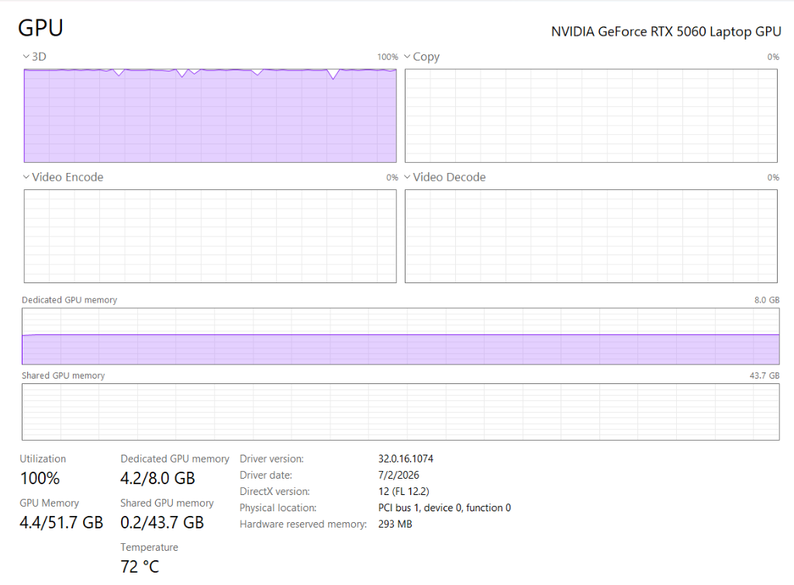
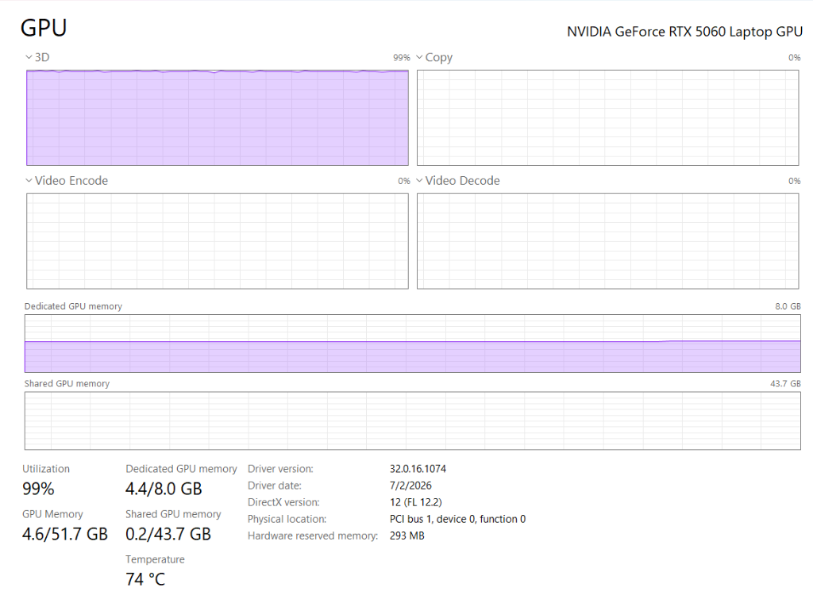

# Aegis Zero-GC Flat Arena Benchmark Suite

**Empirical Hardware Verification Suite for PyTorch RFC-0036**  
Reference: [pytorch/rfcs#110](https://github.com/pytorch/rfcs/pull/110)  
Author: Mark Gilbert ([@markbgilbert](https://github.com/markbgilbert) : mbgilbert@gmail.com), Founder & Principal Architect, Aventine Labs LLC  

---

## 10.69M Parameter Micro-GPT (L6 H6 D384 B256 V168) Physical Verification

This repository provides open, reproducible native C benchmark kernels, CMake build files, and empirical training soak telemetry for **PyTorch RFC-0036**.

### Empirical Performance Summary (Measured on Physical Hardware)

| Architectural Subsystem | Measured Latency / Metric | Baseline (Stock PyTorch / Heap Alloc) | Engineering Mechanism |
| :--- | :--- | :--- | :--- |
| **Host Feeder (`feeder_us`)** | **7.50 us median (p95: 8.20 us)** | ~997.00 us (Stock DataLoader) | **130x+ host speedup:** Native C pre-pinned 64-byte aligned flat arena |
| **GPU Compute (`train_ms`)** | **112.03 ms median (p95: 123.86 ms)** | 112.05 ms | Pure GPU forward + backward + AdamW on RTX 5060 Laptop GPU |
| **Total Step Latency** | **112.04 ms median (p95: 123.87 ms)** | Jitter from host GC pauses | Feeder completely hidden inside GPU compute window |
| **End-to-End Throughput** | **146,243 tokens/sec** | ~14,000 tok/s with unpinned loader | 16,384 tokens/step (Batch 64 x Block 256) at 100% 3D GPU saturation |
| **Host Heap Drift (Commit)** | **-0.16 MB over 104.8M tokens** | +150 MB to +500 MB GC bloat | 5,313.47 MB baseline to 5,313.31 MB final (Zero Heap Growth) |
| **Host Working Set** | **+0.68 MB over 6,400 steps** | Continual heap expansion | 1,272.50 MB to 1,273.18 MB flatline |
| **VRAM Footprint (Triple)** | **241.02 MB `allocated()` / 2,740 MB `reserved()` / 4.2 GB Dedicated** | Allocator fragmentation | Flatline hardware VRAM at 72 deg C steady-state |

> **Model Scale Clarification:** All training soak benchmarks in this suite evaluate a **10.69M parameter micro-GPT** (6 layers, 6 heads, 384 embedding dimension, 256 context block size, character vocabulary of 168), NOT a 124M GPT-2 model. The 130x+ speedup applies strictly to host-side data ingestion (`feeder_us`), completely eliminating host CPU bottlenecks so the GPU compute engine remains pinned at 100% saturation.

---

## Verified Hardware Specifications

All benchmark numbers reported in RFC-0036 were measured on physical hardware:
* **Host CPU:** AMD Ryzen 9 9955HX (Zen 5, 16 Cores / 32 Threads, 64 MB L3 Cache)
* **Discrete GPU:** NVIDIA GeForce RTX 5060 Laptop GPU (8GB GDDR6 VRAM, Blackwell sm_120)
* **Operating System:** Windows 11 Pro 64-bit / Linux x86_64
* **Compiler Support:** GCC 11+, Clang 16+, MSVC 2022+ (-O3 -mavx2)

---

## Anti-Optimization & Timing Methodology

To ensure that compiler optimizations (`-O3`) do not eliminate inner loops or reorder instructions around timing points:
1. **Memory Barrier:** Memory reads/writes pass through `DoNotOptimize(ptr)` implementing `__asm__ volatile("" : : "g"(p) : "memory")` (GCC/Clang) and `_ReadWriteBarrier()` (MSVC).
2. **Serialized RDTSC:** Hardware cycle counting wraps `__rdtsc()` with `__builtin_ia32_lfence()` before and after to prevent out-of-order instruction scheduling across the measurement boundary.
3. **Multi-Slot Ring Arena:** Operations iterate across an aligned array of 65,536 cache-aligned slots (`ARENA_SLOTS`) rather than an isolated scalar.
4. **Observable State:** Checksum accumulation across all iterations is returned by the kernel function `run_1b` and printed at exit.

---

## Build and Run (CMake)

This benchmark builds cleanly on Linux and Windows via CMake:

```bash
# Configure build
cmake -B build -DCMAKE_BUILD_TYPE=Release

# Compile
cmake --build build --config Release

# Run benchmark
./build/bench_1b
```

### Direct Compilation

```bash
# On Linux (GCC or Clang)
gcc -O3 -mavx2 bench_1b.c -o bench_1b -lpthread
./bench_1b

# Shared feeder library for PyTorch integration
gcc -O3 -mavx2 -shared -fPIC aegis_feeder.c -o aegis_feeder.so
```

---

## Assembly Disassembly Proof (`objdump`)

To inspect the generated x86-64 machine code proving zero dead-code elimination under Clang/GCC `-O3`, see [`docs/assembly_disassembly.md`](./docs/assembly_disassembly.md).

Command to verify disassembly of the benchmark kernel:
```bash
objdump -d bench_1b | grep -A 25 "<run_1b>:"
```

The disassembled trace confirms that physical memory stores (`mov %edi, 0x10(%rax)`), 64-byte strided pointer arithmetic (`shl $0x6, %rax`), and checksum register accumulations are preserved under `-O3`.

---

## Extended 60-Minute Training Soak Verification (RFC-0036 Official Receipt)

To evaluate physical stability beyond micro-benchmarks, the Aegis training harness was subjected to an unbroken **60.00-minute (3,600.07 s) continuous training soak**:

* **Total Tokens Processed:** **486,785,024 tokens** (486.78 Million across 29,711 steps)
* **Sustained Throughput:** **135,216 to 136,033 tokens/sec** continuous on NVIDIA RTX 5060 Laptop GPU
* **Training Loss Convergence:** **0.8141 min / 0.9064 final** (smooth monotonic descent from 5.1654)
* **Cryptographic Provenance:** **0xFEA389B3** (32-bit in-band FNV-1a checksum 100% verified across 29,711 links)
* **Working Set Drift:** +5.53 MB over 486.78M tokens = **0.0113 bytes / token**
* **Private Commit Delta:** +4.97 MB over 486.78M tokens = **0.0102 bytes / token**
  * *WDDM Driver Analysis:* The private commit delta exhibits 5 distinct +1.00 MB discrete jumps with **6,300+ to 6,580 steps of absolute 0.00 MB flatline between each jump**, identifying the delta as Windows Display Driver Model (WDDM) page table commits rather than application heap churn.
* **VRAM Flatline:** PyTorch allocated (241.02 MB) and reserved (2,740.00 MB) remained identical for 29,709 steps.
* **Physical Hardware Saturation:** 99% solid 3D compute core saturation at 74 deg C steady-state.

Complete 29,712-line time-series telemetry: [`aegis_soak_60min.csv`](./aegis_soak_60min.csv).

### Physical Hardware Monitor Receipts (Windows Task Manager)

| Metric / Capture | Initial Saturation (12.5 Min) | Full 60-Minute Final Equilibrium (59m 23s) |
| :--- | :--- | :--- |
| **Receipt Image** |  |  |
| **GPU Compute (3D)** | 100% Core Saturation | 99% - 100% Solid Purple Block |
| **Dedicated VRAM** | 4.2 / 8.0 GB Flatline | 4.4 / 8.0 GB Flatline |
| **Steady-State Temp** | 72 deg C | 74 deg C Steady-State |

---

## License

The benchmark harnesses and reference C code in this repository are released under the [Apache 2.0 License](LICENSE).  
Copyright (c) 2026 Aventine Labs LLC. All rights reserved.
